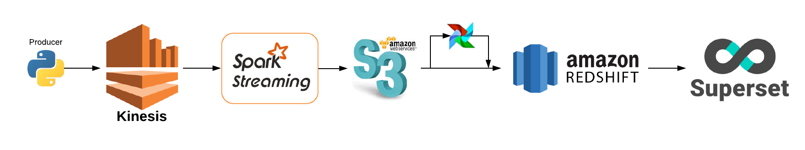

# Increments

## Contents

* Airflow
* Data Generator (Producers)
* Spark Streaming
* Web App

## Project Overview

Increments is a probject that utilizes a streaming data pipeline to implement incremental processing on data. The goal of this project is to provide near-real time processed data to analysts, instead of having them wait hours for the batch jobs to finish

## Pipeline

### Airflow

The airflow folder contains the dags and the actual redshift upload script. The redshift job is scheduled to run every 5 minutes on partitioned data in S3

### Data Generator

This folder contains producer scripts that generate web event data. There are two versions for these scripts, one for Kinesis, one for Kafka.

### Spark Streaming

The spark streaming job uses pyspark, and sets up a stream that processes data every 1 minute and uploads it to s3 in partitions. The spark job uses spark sql to process the data.
The two current jobs are:
* Pre-aggregate data
* Partition and sort the raw logs for Redshift

